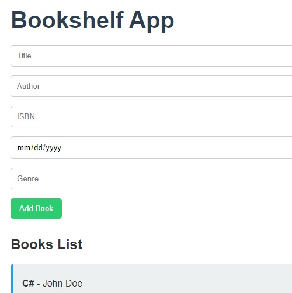

# BookshelfApp


## Description
The **BookshelfApp** project is a CRUD-based web application built using .NET and React, designed to manage a digital collection of books. It allows users to create, read, update, and delete entries in a book catalog, complete with relevant details like title, author, genre, ISBN, and publication date. This project is intended for local use and has been crafted to demonstrate clean architecture, API design, and full-stack integration.

The backend of the project is built using .NET 8 and SQLite, while the frontend is powered by React.js, Axios for API requests, and modern JavaScript for seamless user interaction.



## Table of Contents

- [Installation](#installation)
- [Usage](#usage)
- [Demo](#demo)
- [Badges](#badges)
- [Features](#features)
- [Questions](#questions)

## Installation

To set up and run the project locally, please follow the instructions below:

1. **Clone the repository:**
   ```bash
   git clone https://github.com/jskelly8/net-simple-site.git
   cd net-simple-site
   ```

2. **Backend Setup (BookshelfAPI):**
   - Ensure you have .NET 8 SDK installed on your machine.
   - Navigate to the backend directory:
     ```bash
     cd BookshelfAPI
     ```
   - Restore required packages:
     ```bash
     dotnet restore
     ```
   - Apply any migrations and create the SQLite database:
     ```bash
     dotnet ef database update
     ```
   - Run the backend locally:
     ```bash
     dotnet run
     ```

3. **Frontend Setup (React):**
   - Open a new terminal and navigate to the `frontend` folder (if present):
     ```bash
     cd ../frontend
     ```
   - Install dependencies:
     ```bash
     npm install
     ```
   - Start the frontend locally:
     ```bash
     npm start
     ```

## Usage

Since this application is **not deployed**, it can only be used locally for testing and demonstration purposes. Once the backend and frontend are running, navigate to `http://localhost:3000` in your browser to interact with the application.

To test the API directly, you can use a tool like Insomnia or Postman to send GET, POST, PUT, and DELETE requests to `http://localhost:5280/api/books`.

Please revisit the [Description](#description) section for additional details on the application's functionality.

## Demo

Here is a demo video showing the application's functionality:

<video width="640" height="480" controls>
  <source src="./frontend/public/.NETbookshelfApp.mp4/" type="video/mp4">
  Your browser does not support the video tag.
</video>

## Badges


## Features

This project showcases several key technologies and concepts:

* **.NET 8 & Entity Framework** for backend API creation and database management.
* **SQLite** for a lightweight and easy-to-use database solution.
* **React.js** for building the dynamic user interface.
* **Axios** for making HTTP requests to the backend API.
* **CRUD functionality**: Users can create, read, update, and delete book entries.

For application-specific features, please revisit the [Description](#description) section

## Questions

If you have any questions, feel free to reach out to me via [GitHub](https://github.com/jskelly8/) or email me at jessskelton888@gmail.com.